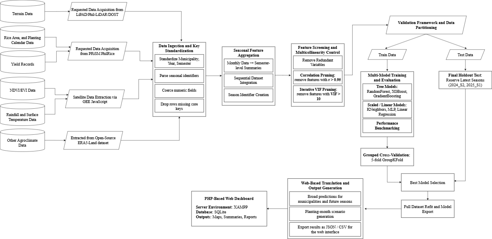

# ARARO: Rice Yield Prediction in Nueva Ecija

**ARARO** stands for **Agricultural Remote-sensing and Analysis for Rice Outcomes**. This repository contains the modeling notebook for an undergraduate capstone project that develops a municipality-level rice yield prediction framework for Nueva Ecija using remote sensing, GIS, agroclimatic variables, terrain features, and machine learning.

This project was developed as an undergraduate capstone for the **Bachelor of Science in Data Science and Analytics** program at the **University of Santo Tomas**.

## Project Overview

Rice production in Nueva Ecija is affected by seasonal climate variability, spatial differences in terrain and crop conditions, and differences in planting patterns across municipalities. This project integrates multiple data sources into a unified municipality-year-semester modeling dataset to analyze and predict seasonal rice yield.

The main notebook builds a machine learning pipeline that:

1. Loads and harmonizes municipality-level yield, remote sensing, climate, terrain, rice area, and planting month datasets.
2. Aggregates predictors into a common municipality-year-semester structure.
3. Performs feature screening, multicollinearity control, and preprocessing.
4. Evaluates multiple regression-based machine learning models.
5. Compares machine learning models against historical baseline models.
6. Selects a deployment-ready model for feature-based prediction and scenario generation.
7. Produces model outputs, diagnostics, and website-ready CSV/JSON files.

## System Architecture and Workflow

The figure below summarizes the overall ARARO workflow, from data acquisition and preprocessing to model training, validation, output generation, and prototype dashboard preparation.



The workflow begins with the acquisition of terrain data, rice area records, planting calendar data, yield records, NDVI/EVI data, rainfall and surface temperature data, and other agroclimate variables. Request-based datasets are obtained from PRiSM/PhilRice and LiPAD, while satellite and climate variables are extracted through Google Earth Engine and open-source gridded datasets.

After acquisition, the datasets are standardized by municipality, year, and semester. The notebook performs key preprocessing steps such as parsing seasonal identifiers, coercing numeric fields, dropping rows with missing core keys, and aggregating monthly predictors into semester-level summaries. Feature screening is then applied to remove redundant variables, control high correlations, and reduce multicollinearity through VIF-based filtering.

The processed dataset is partitioned into training and testing sets using a temporal holdout design. Multiple regression models are trained and evaluated, including Random Forest, XGBoost, Gradient Boosting, Multilayer Perceptron, K-Nearest Neighbors, and Linear Regression. Grouped cross-validation and holdout evaluation are used to support model comparison and selection.

The selected model is refitted and exported for prototype use. Final outputs include prediction tables, diagnostic summaries, planting-month scenario outputs, and CSV/JSON files prepared for web-based visualization and planning support.

## Main Notebook

The main notebook is:

```text
ARARO_rice_yield_modeling_pipeline.ipynb
```

This notebook contains the full modeling workflow, including data preparation, feature engineering, model training, model comparison, diagnostics, and output generation.

## Models Evaluated

The project evaluates the following regression models:

* Random Forest Regressor
* XGBoost Regressor
* Gradient Boosting Regressor
* Multilayer Perceptron Regressor
* K-Nearest Neighbors Regressor
* Linear Regression

Historical baseline models are also used for comparison to check whether machine learning models provide additional predictive value beyond municipality and semester historical averages.

## Selected Model

Random Forest was selected as the prototype deployment model because it supports feature-based predictions and scenario generation using environmental and cropping-context inputs. This makes it more suitable for generating planning-oriented outputs, even when simple historical baselines remain strong benchmarks.

The model outputs are intended for **municipal-level planning and interpretation**, not for direct farm-level prescriptions.

## Repository Structure

```text
araro-rice-yield-prediction/
├── ARARO_rice_yield_modeling_pipeline.ipynb
├── README.md
├── .gitignore
└── assets/
    └── araro_system_architecture.png
```

Some generated outputs may be recreated when the notebook is run locally, such as:

```text
model_df.csv
cv_results.csv
holdout_results.csv
combined_results.csv
baseline_overall.csv
baseline_by_season.csv
web_data/
chapter4_refresh_outputs/
chapter4_final_model_spec/
chapter4_all_model_equation_outputs/
chapter5_figures/
```

These files and folders may be excluded from version control because they are generated by the notebook.

## Data Sources and Availability Notice

This section builds the modeling dataset by combining yield records, remote sensing variables, agroclimate variables, terrain features, rice area, and planting month statistics for municipality-level rice yield modeling in Nueva Ecija.

The table below documents the datasets used in this project, their sources, and the expected local filenames used by the notebook. Some datasets are derived from open or publicly accessible geospatial and climate sources, while others were obtained through request-based access from data providers. Files that are subject to data-sharing restrictions or are too large for regular GitHub upload are excluded from version control through `.gitignore`, but they are still required locally for full notebook reproduction.

| Dataset                                                                         | Source                                                                                                                                                                                              | Expected file/s                       |
| ------------------------------------------------------------------------------- | --------------------------------------------------------------------------------------------------------------------------------------------------------------------------------------------------- | ------------------------------------- |
| NDVI/EVI variables                                                              | Google Earth Engine (GEE), using Sentinel-2 Surface Reflectance Harmonized: `COPERNICUS/S2_SR_HARMONIZED` — https://developers.google.com/earth-engine/datasets/catalog/COPERNICUS_S2_SR_HARMONIZED | `FINAL_NDVI_EVI_2019_2025.csv`        |
| Rainfall variables                                                              | Google Earth Engine (GEE), using GPM IMERG Monthly Final Run V07: `NASA/GPM_L3/IMERG_MONTHLY_V07` — https://developers.google.com/earth-engine/datasets/catalog/NASA_GPM_L3_IMERG_MONTHLY_V07       | `FINAL_RAINFALL_2019_2025.csv`        |
| Surface temperature variables                                                   | Google Earth Engine (GEE), using MODIS Terra Land Surface Temperature 8-Day: `MODIS/061/MOD11A2` — https://developers.google.com/earth-engine/datasets/catalog/MODIS_061_MOD11A2                    | `FINAL_SURFACE_TEMP_2019_2025.csv`    |
| Other agroclimate variables                                                     | Google Earth Engine (GEE), using ERA5-Land Daily Aggregated: `ECMWF/ERA5_LAND/DAILY_AGGR` — https://developers.google.com/earth-engine/datasets/catalog/ECMWF_ERA5_LAND_DAILY_AGGR                  | `FINAL_OTHER_VARS_2019_2025.csv`      |
| Municipality-level rice yield records                                           | Philippine Rice Information System (PRiSM) / PhilRice: https://prism.philrice.gov.ph/                                                                                                               | `NuevaEcija_yield_long.csv`           |
| Original Nueva Ecija yield records, covering 2020 Semester 1 to 2025 Semester 1 | Philippine Rice Information System (PRiSM) / PhilRice: https://prism.philrice.gov.ph/                                                                                                               | `NuevaEcija_2020S1-2025S1_Yield.xlsx` |
| Terrain-derived municipality statistics                                         | LiPAD: https://lipad.dream.upd.edu.ph/                                                                                                                                                              | `terrain_muni_stats.csv`              |
| Rice area records, covering 2020 Semester 1 to 2025 Semester 1                  | Philippine Rice Information System (PRiSM) / PhilRice: https://prism.philrice.gov.ph/                                                                                                               | `rice_muni_*.csv`                     |
| Planting month statistics, covering 2020 Semester 1 to 2025 Semester 1          | Philippine Rice Information System (PRiSM) / PhilRice: https://prism.philrice.gov.ph/                                                                                                               | `planting_muni_*.csv`                 |

> **Note:** The PRiSM/PhilRice and LiPAD datasets were obtained through request-based access and may be subject to data-sharing restrictions. These files are not distributed through this public GitHub repository. To reproduce the notebook, users must request access from the respective data providers and place the approved files in the project directory using the filenames or filename patterns shown above.

## Expected Local Setup

To run the notebook locally, place the required datasets in the same folder as the main notebook using the expected filenames listed above.

Example local setup:

```text
araro-rice-yield-prediction/
├── ARARO_rice_yield_modeling_pipeline.ipynb
├── README.md
├── .gitignore
├── assets/
│   └── araro_system_architecture.png

├── FINAL_NDVI_EVI_2019_2025.csv
├── FINAL_RAINFALL_2019_2025.csv
├── FINAL_SURFACE_TEMP_2019_2025.csv
├── FINAL_OTHER_VARS_2019_2025.csv

├── NuevaEcija_yield_long.csv
├── NuevaEcija_2020S1-2025S1_Yield.xlsx
├── terrain_muni_stats.csv

├── rice_muni_2020S1.csv
├── rice_muni_2020S2.csv
├── rice_muni_2021S1.csv
├── rice_muni_2021S2.csv
├── rice_muni_2022S1.csv
├── rice_muni_2022S2.csv
├── rice_muni_2023S1.csv
├── rice_muni_2023S2.csv
├── rice_muni_2024S1.csv
├── rice_muni_2024S2.csv
├── rice_muni_2025S1.csv

├── planting_muni_2020S1.csv
├── planting_muni_2020S2.csv
├── planting_muni_2021S1.csv
├── planting_muni_2021S2.csv
├── planting_muni_2022S1.csv
├── planting_muni_2022S2.csv
├── planting_muni_2023S1.csv
├── planting_muni_2023S2.csv
├── planting_muni_2024S1.csv
├── planting_muni_2024S2.csv
├── planting_muni_2025S1.csv
```

## Running the Notebook

1. Clone or download this repository.
2. Place the required local datasets in the project folder.
3. Open `ARARO_rice_yield_modeling_pipeline.ipynb`.
4. Run the notebook from top to bottom.
5. Generated outputs will be created locally, including modeling tables, validation results, selected model diagnostics, and website-ready outputs.

## Important Notes

* This repository does not distribute restricted PRiSM/PhilRice or LiPAD datasets.
* Large processed CSV files may also be excluded from GitHub because of file size limitations.
* The notebook is designed to run locally when the expected files are available in the project directory.
* The model outputs are intended for planning-level interpretation and should not be treated as direct farm-level recommendations.
* The results are specific to Nueva Ecija and the 2020–2025 study period.

## Authors

* Althea Grace Concha
* George Emanuel B. Cruz

Bachelor of Science in Data Science and Analytics
University of Santo Tomas
Undergraduate Capstone Project, 2026
